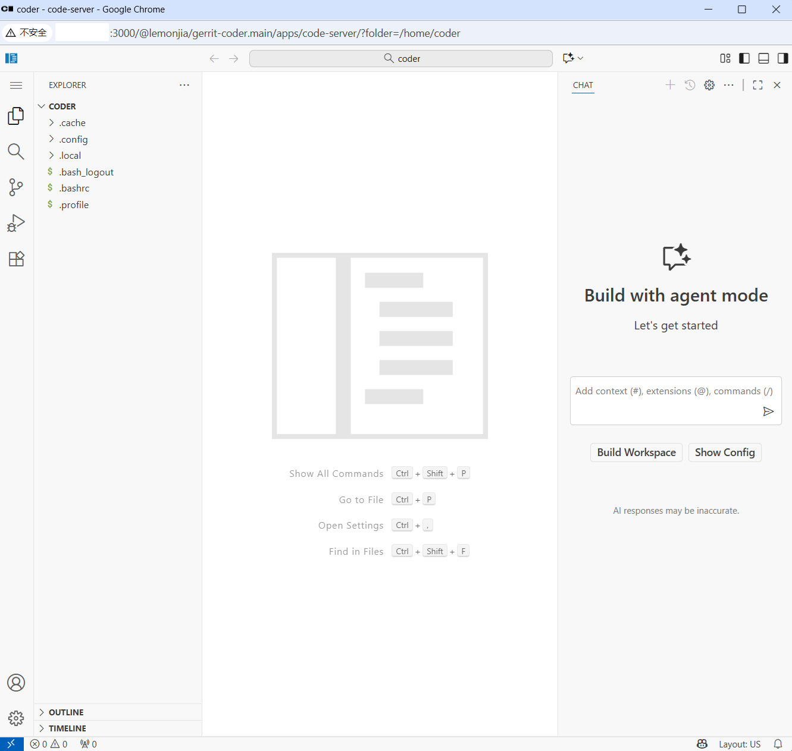

# coder test

Spin up a local Coder server in Docker, push a Terraform template, and launch a VS Code Web workspace powered by code-server.

## What’s here

- `coder.sh` — starts a Coder server container (`ghcr.io/coder/coder:latest`) on port 3000
- `template.sh` — logs into the Coder server (via CLI in the container) and pushes the Terraform template
- `code-server.tf` — Terraform template that creates a Docker-based workspace and runs code-server inside it

## Prerequisites

- Docker Engine
- Port 3000 available on your host

## Quickstart

1) Make scripts executable and start the Coder server

```bash
chmod +x coder.sh template.sh
./coder.sh
```

This runs a container named `coder-server` listening on http://127.0.0.1:3000 (and using `CODER_ACCESS_URL` for external links).

2) Open the UI and create a token

- Visit: http://127.0.0.1:3000
- Create/sign in to your account
- In the UI: Avatar → Account → Tokens → Create a session token

3) Push the Terraform template

Set your token and optionally tweak settings, then run `template.sh`:

```bash
# Optional overrides
# export CODER_URL="http://127.0.0.1:3000"     # Coder API endpoint used by the CLI
# export CODER_TEMPLATE_NAME="vscode-web"      # Template name to push/update
export CODER_SESSION_TOKEN="<your_token_here>"

./template.sh
```

You should see a success message after the template is pushed.

4) Create a workspace from the template

- In the UI: Templates → `vscode-web` → New Workspace
- Accept defaults and create. Coder will run the Terraform in the server container and start a workspace Docker container.
- When the workspace is ready, open the app "VS Code Web" to get a browser-based VS Code.

## UI snapshots

Here are a few quick screenshots of the flow in the Coder UI:

- Templates view


- Workspaces view


- VS Code Web (code-server) app



## Environment variables

- `CODER_ACCESS_URL` (in `coder.sh`): external URL Coder advertises. Default: `https://your-coder.com:3000` — change to your host/IP if needed.
- `CODER_URL` (both scripts): API endpoint used by the CLI. Default: `http://127.0.0.1:3000`.
- `CODER_TEMPLATE_NAME` (both scripts): template name to push. Default: `vscode-web`.
- `CODER_SESSION_TOKEN` (used by `template.sh`): your session token from the Coder UI. Required to authenticate the CLI.

Security note: `template.sh` includes a hard-coded token value for convenience in local testing. Always override it with `CODER_SESSION_TOKEN`, and never commit real tokens.

## How it works

The template (`code-server.tf`) uses:

- `coder_agent` to bootstrap a Coder agent in the workspace
- Installs and starts `code-server` on port 13337 inside the workspace
- Registers a Coder app so you can open VS Code Web directly from the Coder UI
- `docker_container` provider to create the workspace container on your host via the Docker socket mounted into the Coder server container

## Cleanup

Stop and remove everything created by these scripts:

```bash
# stop coder server
docker rm -f coder-server || true

# remove coder data (removes users, templates, etc.)
rm -rf "$HOME/.config/coderv2-docker"

# remove any workspace containers named like coder-<workspace>
docker ps -a --format '{{.ID}} {{.Names}}' | awk '/^.* coder-/{print $1}' | xargs -r docker rm -f
```

## Troubleshooting

- Port 3000 in use: stop the conflicting service or change the published port in `coder.sh` (`-p 3000:3000`).
- `coder` CLI not found in container: the script expects it at `/opt/coder` in the `ghcr.io/coder/coder:latest` image. Use a recent image tag.
- Template push unauthorized: set `CODER_SESSION_TOKEN` correctly and ensure `CODER_URL` points to your server.
- Workspace creation fails due to Docker permissions inside the Coder server container: the script tries to map your host Docker group into the container. If your Docker group GID differs or is missing, you may need to recreate the container after verifying `DOCKER_GROUP` and that `/var/run/docker.sock` is mounted.

## Notes

- Default URLs: the UI is reachable at `http://127.0.0.1:3000` locally. If accessing from another machine, set `CODER_ACCESS_URL` in `coder.sh` to the host’s reachable IP/hostname before starting the server.
- The `code-server` app listens on port 13337 inside the workspace and is proxied via the Coder UI app entry; you don’t need to open this port directly.

## Reference

- [coder-api-workspace](https://coder.com/docs/reference/api/workspaces)
- [coder-install-docker](https://coder.com/docs/install/docker)
